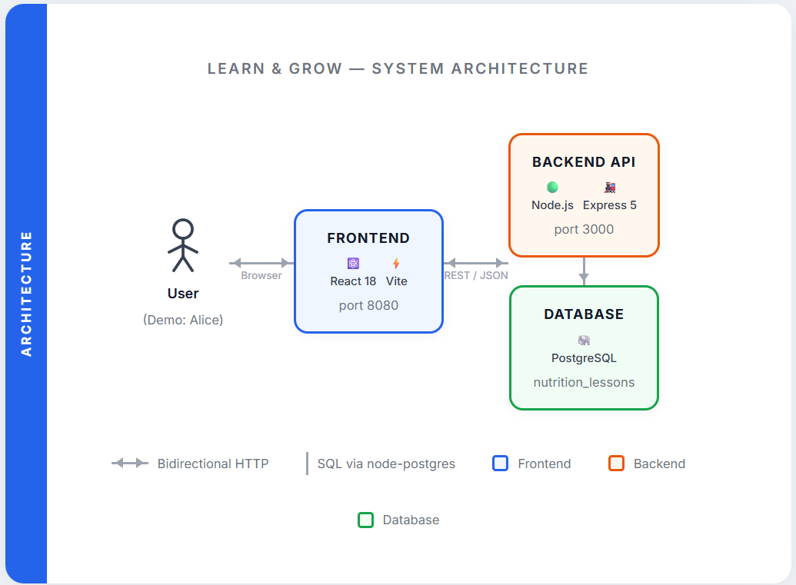

# Learn & Grow — Nutrition Education App

## 1. App Summary

Learn & Grow is a nutrition education web application built for busy young adults who want to understand food without the overwhelm of diet culture or calorie tracking. The core problem it addresses is that most people lack foundational nutrition knowledge — not because they don't care, but because existing resources are either too clinical, too prescriptive, or too time-consuming to fit into a real daily routine. Rather than telling users what to eat, Learn & Grow focuses on education and understanding: how different nutrients affect the body, how to read food labels confidently, and how to apply nutrition principles to their own goals and preferences. The platform delivers this through short, interactive lessons backed by science and grounded in real-world food examples, paired with light gamification to keep users engaged and motivated. Lessons unlock progressively as users advance, and a quiz at the end of each lesson (requiring 60% or higher to pass) reinforces learning before moving on. Progress is persisted to a PostgreSQL database so users can pick up exactly where they left off across sessions.

---

## 2. Tech Stack

| Layer | Technology |
|---|---|
| **Frontend Framework** | React 18 (TypeScript) |
| **Frontend Tooling** | Vite, Tailwind CSS, shadcn/ui, Radix UI |
| **Routing** | React Router DOM v6 |
| **Backend Framework** | Node.js with Express 5 |
| **Database** | PostgreSQL (v12+) |
| **Database Client** | node-postgres (`pg`) |
| **Environment Config** | dotenv |
| **Authentication** | None (demo user auto-login as Alice, user_id = 1) |
| **External Services** | None |

---

## 3. Architecture Diagram



**Data flow:** The React frontend (Vite dev server on port 8080) makes REST API calls to the Express backend (port 3000). The backend queries the PostgreSQL database using `pg` and returns JSON. No external APIs or third-party services are used.

---

## 4. Prerequisites

Ensure the following are installed before proceeding. Each item includes a verification command to confirm it is available in your system PATH.

**Node.js** (v16 or higher) — [Download here](https://nodejs.org/)
```sh
node --version   # should print v16.x.x or higher
```

**npm** (comes bundled with Node.js)
```sh
npm --version
```

**PostgreSQL** (v12 or higher) — [Download here](https://www.postgresql.org/download/)
```sh
psql --version   # should print psql (PostgreSQL) 12.x or higher
```
> **Windows users:** After installing PostgreSQL, ensure the `bin` folder (e.g., `C:\Program Files\PostgreSQL\16\bin`) is added to your system PATH so that `psql` is accessible from the terminal.

**Git** — [Download here](https://git-scm.com/)
```sh
git --version
```

**A code editor** (VS Code recommended) — [Download here](https://code.visualstudio.com/)

---

## 5. Installation and Setup

### Step 1: Clone the Repository

```sh
git clone <REPOSITORY_URL>
cd learn-grow-ui
```

### Step 2: Install Dependencies

```sh
npm install
```

Or if you prefer Bun ([Download Bun here](https://bun.sh/)):

```sh
bun install
```

### Step 3: Set Up PostgreSQL Database

1. **Start PostgreSQL** on your machine and ensure the service is running.

2. **Open a PostgreSQL client** — either `psql` in your terminal or pgAdmin.

3. **Create the database:**
   ```sql
   CREATE DATABASE nutrition_lessons;
   ```

3. **Create the database schema**:
   - Open [schema.sql](schema.sql) from the project root
   - Copy and paste the contents into your PostgreSQL client (pgAdmin, psql, etc.)
   - Execute the SQL to create the `users` and all consquent tables

4. **Seed the database** with sample data:
   - Open [seed.sql](seed.sql) from the project root
   - Copy and paste the contents into your PostgreSQL client
   - Execute the SQL to populate the database with sample users and all units, lessons, and quizzes

### Step 4: Configure Environment Variables

The project uses a `.env` file that is **not included in the repository** (it is listed in `.gitignore`). You must create it manually.

In the project root, create a new file named exactly `.env` (no `.example` extension). You can do this from your terminal:

**macOS / Linux:**
```sh
cp .env.example .env
```

**Windows (PowerShell):**
```powershell
copy .env.example .env
```

Then open `.env` in your code editor and fill in your credentials. The file should look like this:

```env
# Database Configuration
DB_USER=postgres
DB_PASSWORD=password
DB_HOST=localhost
DB_PORT=5432
DB_NAME=learn_grow

# Server Configuration
PORT=3001
```

**Important:** Replace `<YOUR_POSTGRES_PASSWORD>` with your actual PostgreSQL password. If you did not set a password when installing PostgreSQL, try leaving the value blank or using `postgres`.

---

## 6. Running the Application

The application requires **two terminals running simultaneously.**

**Terminal 1 — Start the API Server** (port 3000):
```sh
npm run api
```
You should see: `API server running on port 3000`

**Terminal 2 — Start the Frontend Dev Server** (port 8080):
```sh
npm run dev
```
You should see: `Local: http://localhost:8080/`

**Then open your browser and navigate to:**
```
http://localhost:8080
```

The application will automatically log you in as the demo user Alice. The home page should display three lessons:
1. **Nutrition Basics** — Completed
2. **Proteins** — In Progress
3. **Healthy Fats** — Locked


## 7. Verifying the Vertical Slice

This section walks through the full vertical slice: triggering a feature in the UI, confirming the database was updated, and verifying the change persists after a page refresh.

**The feature:** Completing the "Proteins" quiz marks the lesson as `Completed` in the database.

### Steps to trigger the feature:

1. **View a lesson**: Click on "Proteins" to read the lesson material
2. **Take a quiz**: Click "Quiz Me" to attempt the quiz (get 60% or higher to pass)

### Confirm the database was updated:

Open pgAdmin or a `psql` terminal and run:

```sql
SELECT * FROM user_lessons WHERE user_id = 1;
```

You should see a row for `lesson_id = 2` (Proteins) with `status = 'Completed'` and a timestamp in the `completed_at` column.

### Verify persistence after refresh:

1. Refresh the browser page (`Ctrl+R` or `F5`).
2. The home screen should still show **Proteins** as Completed and **Healthy Fats** as unlocked — confirming the state was read back from the database and not just held in memory.

### Troubleshooting

**Issue: "Cannot connect to database"**
- Ensure PostgreSQL is running on your machine
- Verify the database credentials in `.env` match your PostgreSQL setup
- Check that the `nutrition_lessons` database exists

**Issue: "API not responding" (port 3000 error)**
- Ensure the API server is running in Terminal 1 (`npm run api`)
- Check that port 3000 is not in use by another application
- Verify the `.env` file has `API_PORT=3000`

**Issue: "Page showing 'Connecting to API...'" for a long time**
- Check that both servers are running (Terminal 1 and Terminal 2)
- Open browser Developer Tools (F12) → Console tab to see any error messages
- Verify `VITE_API_URL=http://localhost:3001` in `.env`

**Issue: "Cannot find module" after fresh install**
- Try deleting `node_modules` folder and `.env` cache:
  ```sh
  rm -r node_modules
  npm install
  ```
- Or on Windows:
  ```powershell
  Remove-Item -Recurse node_modules
  npm install
  ```

### Stopping the Application

Press `Ctrl+C` in both terminal windows to stop the servers.

## 8. EARS Requirements
**Complete**

- The system shall accept display nutrition lessons to the user.
- The system shall provide score feedback after a quiz is taken by a user.
- When a user selects a lesson, the system shall display the lesson and lesson cards.
- While the system is providing a lesson to the user, the system shall show a lesson progress indicator.
- When a user selects a wrong answer on a quiz, the system shall show it as incorrect with the correct answer highlighted.

**Not Complete**

- When a user opens their profile, the system shall display current user's progress page.
- When a user selects their badges page, the system shall display all badges the user has obtained.
- When a user opens the settings page, the system shall display the settings page.
- When a user selects a, the system shall adjust the playback speed for sign videos accordingly.
- While quiz is being taken, the system will not allow the user to proceed until an answer is selected.
- The system shall accept valid login requests
- When a new user starts the app, the system shall suggest they make an account.
- When a not logged in user uses the app, the system shall only allow the 1st lesson to be used.
